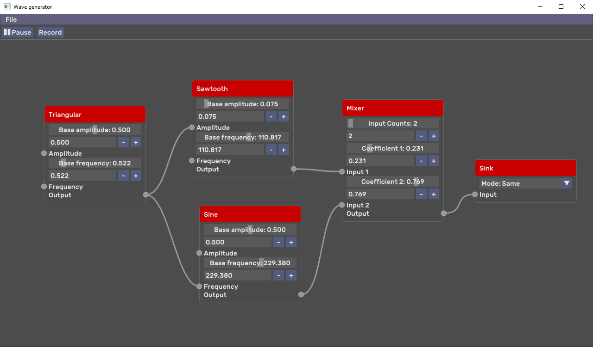

# Wave generator

Node based sound generator written on C++/CMake with ImGui, also supports WAV loading/saving.



## What is this?

It is node based signal generator. Generated signal can be saved to [WAV format](https://en.wikipedia.org/wiki/WAV).
Now supports following generators:
* [Pulse signal](https://en.wikipedia.org/wiki/Square_wave) with duty cycle
* [Sawtooth signal](https://en.wikipedia.org/wiki/Sawtooth_wave)
* [Triangle wave](https://en.wikipedia.org/wiki/Triangle_wave)
* [Sine wave](https://en.wikipedia.org/wiki/Sine_wave)
* [White noise](https://en.wikipedia.org/wiki/White_noise)

Created with [SDL2](https://www.libsdl.org/) and [ImGui](https://github.com/ocornut/imgui/).

##How to build

Requirements:
* OpenGL >= 4.2, or otherwise:
    * change **_kOpenGlVersion_** and **_kGlslVersion_** in [application_config.h](./app/application_config.h))
    * change **_API_** version in [glad2_loader/CMakeLists.txt](./3rd_party/glad2_loader/CMakeLists.txt)
* C++ compiler supporting C++20 standard
* CMake >= 3.15
    * otherwise, try change **_VERSION_** in [CMakeLists.txt](./CMakeLists.txt)
* 

---
**Warning!:** Project dependencies is almost **100 MB**

---

Clone project with submodules (choose one of the repositories):
```shell script
git clone https://github.com/ValeryKameko/wave-generator --recurse-submodules
git clone https://gitlab.com/ValeryKameko/wave-generator --recurse-submodules
```
Build CMake project:
```shell script
cd    ./wave-generator
mkdir ./cmake-build-release
cd    ./cmake-build-release
cmake .. -DCMAKE_BUILD_TYPE=Release
```

To run application:
```shell script
cd ./app

# for WINDOWS
./wave-generator.exe

# for LINUX
./wave-generator
```

Tested on:
* Windows (GNU GCC 9.0 MinGW, CMake 3.15, OpenGL 4.6)